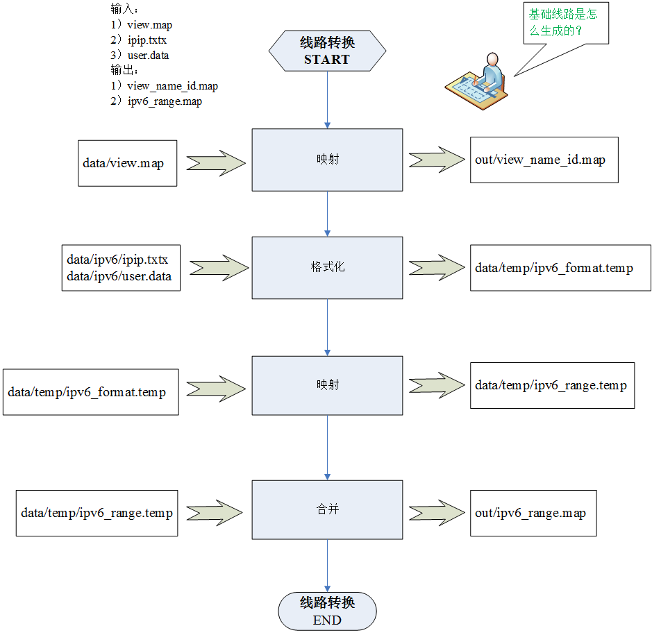

## 综述
### 主要功能：
1. 将用户提供的IP信息转换为dns程序中使用的基础视图;
2. 支持IPV6的IPIP.txtx格式及自定义格式user.data;
3. 支持IPV4的IPIP.txtx格式及自定义格式user.data;

## 使用
```bash
# 将最新的ipip.txtx文件和user.xxx文件放入data目录
# sh ./build.sh
# sh ./output/bin/control start/stop/restart/status(每天凌晨执行一次)
# ls ./output/out/ (最新文件位于此文件夹)
```
## 数据源
1. ./data/ipv4/ipip.txtx  - [ipip.txtx v4格式文件](https://www.ipip.net/)
2. ./data/ipv6/ipip.txtx  - [ipip.txtx v6格式文件](https://www.ipip.net/)
3. ./data/ipv4/user.xxx   - ipv4自定义文件
4. ./data/ipv6/user.xxx   - ipv6自定义文件

## 地址库转换规则
```bash
Reserved = ['保留地址', '本地地址', '局域网', '共享地址']
Internal = ['广州私网地址', '华北私网地址', '宿迁私网地址']
Continents = ['亚洲', '欧洲', '非洲', '北美洲', '南美洲', '大洋洲']
Searchs = ['yahoo', 'google', 'baidu', '360']
Countrys = ['美国', '阿根廷', '澳大利亚', '奥地利', '玻利维亚', '巴西', '柬埔寨', '加拿大', '智利', '哥伦比亚',
            '丹麦', '厄瓜多尔', '埃及', '英国', '芬兰', '法国', '希腊', '德国', '印度', '印度尼西亚',
            '意大利', '日本', '哈萨克斯坦', '韩国', '老挝', '马来西亚', '马尔代夫', '墨西哥', '缅甸', '尼泊尔',
            '荷兰', '新西兰', '挪威', '巴基斯坦', '巴拿马', '巴拉圭', '秘鲁', '菲律宾', '葡萄牙', '罗马尼亚',
            '俄罗斯', '沙特阿拉伯', '新加坡', '南非', '西班牙', '瑞典', '瑞士', '土耳其', '乌克兰', '阿联酋',
            '乌拉圭', '委内瑞拉', '越南', '泰国', '中国']

MainOperators = ['电信', '联通', '移动', '广电']
OtherOperators = ['电信通', '长城', '教育网', '铁通', '方正', '华数', '中信', '东方有线']

def format_ipip(ipip_file_name, out_file_name):
    try:
        with codecs.open(ipip_file_name, 'r', 'UTF-8') as fr,\
                codecs.open(out_file_name, 'a', 'UTF-8') as fw:
            fw.seek(0)
            fw.truncate()
            for line in fr:
                line = line.strip()
                # 跳过注释行和空行
                if not len(line) or line.startswith('#'):
                    continue
                tmp = line.split()
                # ip-start  ip-end   国家    省份    地级市   学校或单位 运营商
                # tmp[0]    tmp[1]   tmp[2]  tmp[3]  tmp[4]  tmp[5]    tmp[6]
                # 保留地址
                if str_in_list(tmp[2], Reserved):
                    tmp[2] = '保留地址'
                    tmp[3] = tmp[6] = 'none'
                # 内部地址
                if str_in_list(tmp[2], Internal):
                    tmp[3] = tmp[6] = 'none'
                # 大洲地址
                if '亚太地区' in tmp[2]:
                    tmp[2] = '亚洲'
                    tmp[3] = tmp[6] = 'none'
                if '拉美地区' in tmp[2]:
                    tmp[2] = '南美洲'
                    tmp[3] = tmp[6] = 'none'
                if '欧洲地区' in tmp[2]:
                    tmp[2] = '欧洲'
                    tmp[3] = tmp[6] = 'none'
                if '非洲地区' in tmp[2]:
                    tmp[2] = '非洲'
                    tmp[3] = tmp[6] = 'none'
                if '北美地区' in tmp[2]:
                    tmp[2] = '北美洲'
                    tmp[3] = tmp[6] = 'none'

                # 将yahoo/baidu/google/360移到国家位置
                # 由于IPIP.txtx没有搜索引擎的IP特征，删除此处匹配
                # 如果需要配置，请在自定义文件user.xxxx中手动配置

                # 处理支持的国家
                if str_in_list(tmp[2], Countrys) and '中国' not in tmp[2]:
                    tmp[3] = tmp[6] = 'none'
                # 处理不支持的国家
                if str_not_in_list(tmp[2], Countrys + Searchs + Continents + Reserved + Internal):
                    tmp[2] = '海外线路'
                    tmp[3] = tmp[6] = 'none'
                # 处理港澳台
                if '香港' in tmp[3] or '澳门' in tmp[3] or '台湾' in tmp[3]:
                    tmp[6] = 'none'
                # 处理中国不支持的运营商
                if '中国' in tmp[2] and \
                    '香港' not in tmp[3] and \
                        '澳门' not in tmp[3] and \
                        '台湾' not in tmp[3]:
                    if str_not_in_list(tmp[6], MainOperators + OtherOperators):
                        tmp[3] = 'none'
                        tmp[6] = '其他运营商'
                # 处理四大运营商的省份信息及运营商信息
                mainoper = str_in_list(tmp[6], MainOperators)
                if mainoper:
                    if '中国' in tmp[3]:
                        tmp[3] = '其他'
                    tmp[6] = mainoper
                # 将包含省份信息的铁通归入相应省份的移动
                if '铁通' in tmp[6]:
                    if '中国' not in tmp[3]:
                        tmp[6] = '移动'
                # 处理第三方运营商的省份信息及运营商信息
                otheroper = str_in_list(tmp[6], OtherOperators)
                if otheroper:
                    tmp[3] = 'none'
                    tmp[6] = otheroper

                # 写入规范化文件
                fw.writelines([tmp[0], '-', tmp[1], '\t', tmp[2], '\t',
                               tmp[3], '\t', tmp[6], '\n'])
    except Exception:
        logging.error("traceback.format_exc():%s", traceback.format_exc())
        sys.exit(1)
```
## 流程


## 格式
### 输入文件 
#### data/ipv4/ipip.txtx

| 列数  | 说明                    | 实例      |
| ----- | ----------------------- | --------- |
| 第1列 | ip段起始IP              | 1.1.1.0   |
| 第2列 | ip段终止IP              | 1.1.1.255 |
| 第3列 | 所属搜索引擎/大洲/国家  | 中国      |
| 第4列 | 所属省份或直辖市        | 河北      |
| 第5列 | 地级市/省直辖县级行政区 | 保定      |
| 第6列 | 学校或单位              | 河北大学  |
| 第7列 | 运营商                  | 教育网    |

#### data/ipv4/user.[时间戳]

| 列数  | 说明                      | 实例                            |
| ----- | ------------------------- | ------------------------------- |
| 第1列 | cidr格式/横杠分割的地址段 | 1.1.1.1/24 或 1.1.1.0-1.1.1.255 |
| 第2列 | 所属搜索引擎/大洲/国家    | 中国                            |
| 第3列 | 所属省份或直辖市          | 河北                            |
| 第4列 | 运营商                    | 教育网                          |

#### data/ipv6/ipip.txtx

| 列数  | 说明                    | 实例              |
| ----- | ----------------------- | ----------------- |
| 第1列 | cidr格式ipv6地址段      | 2001:250:400::/48 |
| 第2列 | 所属搜索引擎/大洲/国家  | 中国              |
| 第3列 | 所属省份或直辖市        | 河北              |
| 第4列 | 地级市/省直辖县级行政区 | 保定              |
| 第5列 | 学校或单位              | 河北大学          |
| 第6列 | 运营商                  | 教育网            |

#### data/ipv6/user.[时间戳]

| 列数  | 说明                      | 实例                                                   |
| ----- | ------------------------- | ------------------------------------------------------ |
| 第1列 | cidr格式/横杠分割的地址段 | 2001:250:400::/48 或 2001:250:400::-2001:250:400::ffff |
| 第2列 | 所属搜索引擎/大洲/国家    | 中国                                                   |
| 第3列 | 所属省份或直辖市          | 河北                                                   |  |
| 第4列 | 运营商                    | 教育网                                                 |

### 输出文件

#### out/view_name_id.map 

| 列数  | 说明               | 实例              |
| ----- | ------------------ | ----------------- |
| 第1列 | 视图名称           | view_beijing_cmcc |
| 第2列 | 视图编号           | 2                 |
| 第3列 | 上级视图名称(可选) | view_hk_mo_tw     |

#### out/ip_range.map 

| 列数  | 说明               | 实例     |
| ----- | ------------------ | -------- |
| 第1列 | ip段起始IP整数表示 | 34632960 |
| 第2列 | ip段终止IP整数表示 | 34633727 |
| 第3列 | 视图编号           | 2        |

#### out/ipv6_range.map 

| 列数  | 说明               | 实例              |
| ----- | ------------------ | ----------------- |
| 第1列 | cidr格式ipv6地址段 | 2001:250:400::/48 |
| 第2列 | 视图编号           | 2                 |